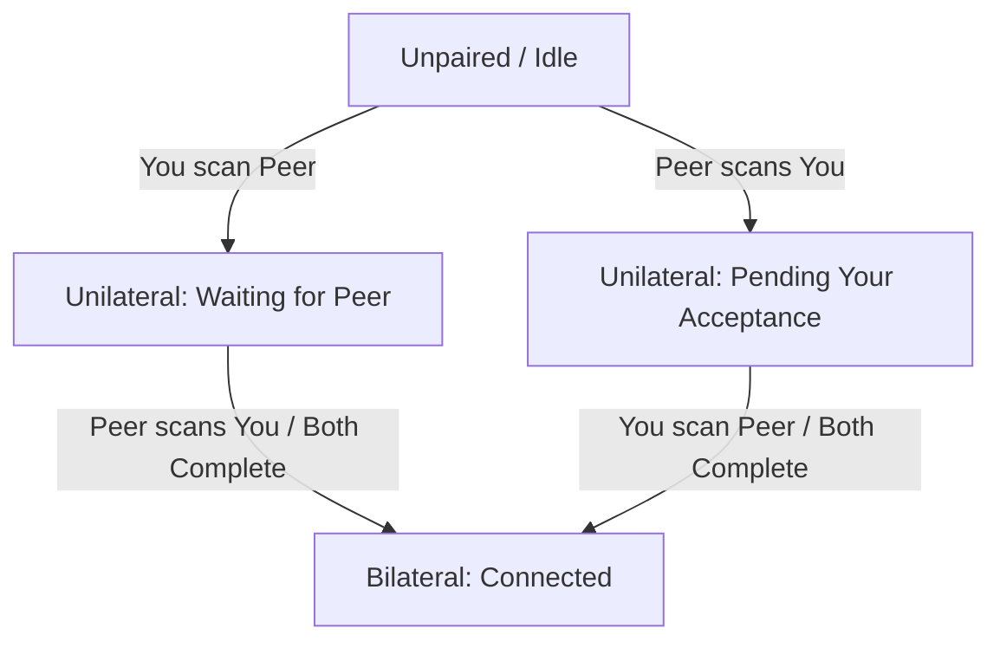

# EchoIt Product Definition

EchoIt is a local-first, privacy-respecting messaging application targeting mobile (Android, iOS) and desktop devices. This document establishes the brand positioning, verbal guidelines, tone of voice rules, and product postures for the app.

---

## 1. Audience & Positioning

EchoIt is built for **ordinary, everyday people** who want to communicate privately without their personal lives being scanned, harvested, or stored by tech conglomerates. It is designed as a direct, privacy-respecting WhatsApp alternative. 

### The Core Posture
Our verbal posture is anchored to a single, non-negotiable statement of fact:

> **"Your messages stay on your phone. We can't read them. We don't want to."**

We speak to the user's desire for personal space. We do not sell high-tech sovereignty; we offer peace of mind.

### The Claim, Stated Exactly

Because the posture above is absolute, every narrower claim has to survive
inspection. There is exactly one thing EchoIt sends to a server, and we say it
rather than let someone discover it:

> **"The only thing EchoIt asks a server is whether there's a new version.
> Everything else goes straight between your device and theirs."**

This is deliberately checkable — anyone can watch the network and confirm it.
The strict CSP means the app *cannot* reach anywhere else even if a dependency
tried.

**Do not write, anywhere, ever:** "EchoIt never connects to a server", "nothing
ever leaves your device", or "no data is ever transmitted". Each is false by a
small margin, and a small false claim is what makes people doubt the large true
ones. See §4.3 for the update check itself.

---

## 2. Brand Personality

Our personality is **warm, quiet, and unhurried**. 

EchoIt should feel closer to a **paper notebook** than a high-tech control panel. It is a quiet corner for conversation, not a dashboard or a command-line terminal.

| Trait | What it means | What it is NOT |
| :--- | :--- | :--- |
| **Warm** | Tactile, human, and comforting. We use soft, clear language and organic tones. | Soft-pedaling, clinical, or overly casual (no excessive emojis or hype). |
| **Quiet** | Calm and low-friction. We respect user attention. Notifications are minimal and text is direct. | Cluttered, noisy, or demanding. No gamification or engagement loops. |
| **Unhurried** | We let actions take their natural time. Building a secure local connection is treated with care. | Slow or unresponsive. We optimize performance but do not rush the user. |
| **Local** | Everything stays with the user. The device is the center of their messaging universe. | Cloud-dependent, centralized, or remote. |
| **Direct** | Clear, honest, and plain-spoken. We describe what is happening without sugarcoating. | Technical, jargon-dense, or cryptographic. |

---

## 3. Verbal Rules (Non-Negotiable)

To ensure the app remains accessible to ordinary people, **never lead with cryptographic or protocol jargon**. Focus on the utility and physical reality of the user's actions.

### Jargon Translation Guide

*   **Never lead with**: "decentralized", "zero-knowledge", "peer-to-peer", "protocol", or "cryptographic".
*   **Instead, describe the outcome**:

| Technical Concept (Do Not Use in UI) | Human Copy (Always Lead With) |
| :--- | :--- |
| *Zero-knowledge protocol* | "We design the app so we have no access to your conversations." |
| *Peer-to-peer connection* | "Messages go directly from your device to theirs." |
| *Cryptographic identifier (DID)* | "Your private identity ticket" or "your safe address." |
| *Decentralized architecture* | "There is no central server holding your history; it lives only on your phone." |
| *Pairing handshake / key exchange* | "Connecting your devices directly." |

---

## 4. Crucial Disclosures & Limitations

EchoIt values radical transparency. We must tell the truth about what our technology can and cannot do. We never create a false sense of security.

### 1. Local Device Security (At-Rest Encryption)
*   **The Reality**: The application security key protects your cryptographic identity secrets. However, **message bodies and history are not currently encrypted at rest on the device**. Anyone with access to the phone's filesystem can read your messages and chat history in plaintext. *(Verified against SDK 0.3.1: `storageKey` reaches only `SecretBox`, which seals the identity secret columns. Message bodies go to `message_stream` verbatim and CRDT state to `crdt_documents` as raw Automerge bytes — neither passes through a cipher.)*
*   **Verbal Rule**: We say *"Your messages stay on your phone."* We **never** write copy implying that *"Your messages are protected on your phone"* or *"Your local history is encrypted."* We must explicitly guide the user to secure their physical device.
*   **UI Warning Copy**:
    > *"Your chat history is stored locally on this phone. Because message files are not encrypted on your device's disk, someone who gains physical access to your phone might be able to read them. We recommend keeping a strong lock screen password or PIN enabled."*

### 3. Update Checks — the one server EchoIt talks to *(settled 2026-08-20)*

*   **The Reality**: EchoIt checks GitHub once a day to see whether a newer
    version exists. That is the only server it ever contacts. The request
    carries no identifier, no counter, and nothing about you — but GitHub can
    see an IP address and roughly when the app was opened.
*   **Verbal Rule**: We say this out loud rather than hoping nobody asks. We
    never write "EchoIt never connects to a server" — that would be false, and a
    small false claim undermines the large true ones. The honest framing is
    *"the only thing EchoIt asks a server is whether there's a new version."*
*   **UI Copy** (Settings, beside the toggle):
    > *"Check for updates — EchoIt asks GitHub once a day whether a newer
    > version is available. It's the only time the app talks to a server, and it
    > sends nothing about you or your conversations. You can turn this off, but
    > then you'll need to check for new versions yourself."*
*   **Control**: A toggle in Settings, on by default.

### 2. Spam Protection
*   **The Reality**: The anti-spam machinery (including rate-limiting RLN proofs for identified channels) is deactivated in the current build.
*   **Verbal Rule**: We **must not** claim or promise any form of spam protection, message rate-limiting, or automated system defense in user-facing copy.

---

## 5. Pairing States & Microcopy

Pairing in EchoIt is mutual and can fail silently: if only one person adds the other's ticket, the dialing device shows "connected" but messages will never be delivered to the other side. 

To solve this, we define three distinct visual and verbal states to make incomplete pairing highly visible.

### State 1: Unilateral — Waiting for Them (You added them, they haven't added you)
*   **Visual Indicator**: Muted clay/rust circle icon, dashed border. Outbox messages show as **`Staged`**, never `Sent` (see §5b).
*   **Primary Copy**:
    > *"Waiting for [Name] to connect back."*
*   **Explanatory Microcopy**:
    > *"You've added [Name], but they haven't added you yet. To start messaging, [Name] needs to scan your ticket or copy your connection link."*

### State 2: Unilateral — Pending Your Acceptance (They added you, you haven't added them)
*   **Visual Indicator**: Clay dot (`--color-primary`) on the Contacts tab and
    an inline banner at the top of the conversation. **No notification, no
    push, no badge on the app icon** — a knock never interrupts you (see the
    request rules below). The written spec once called for a "soft blue dot";
    the palette has no blue and deliberately runs warm, so clay is used
    instead. If invitations ever need to read as distinct from state 1 at a
    glance, that is a decision to add one cool accent to the system, not to
    improvise a colour here.
*   **Identity Resolution**:
    *   *With Display Name Metadata*: If the ticket was received containing an out-of-band self-asserted name (e.g., bundled in a QR or invite link):
        *   **Primary Copy**: *"[Name] wants to connect with you."*
        *   **Action button**: *"Connect with [Name]"*
    *   *Without Name (Genuine Stranger / Raw Ticket)*: If no display name metadata is available:
        *   **Primary Copy**: *"A new peer wants to connect"* or *"A device (ending in ...[last 4 of ID]) wants to connect."*
        *   **Action button**: *"Connect"*
*   **Explanatory Microcopy**:
    > *"Once you accept their ticket, you will be able to exchange messages directly. No messages can be delivered until you connect back."*
*   **Connection requests**: A stranger who connects lands in a **Requests**
    list. Nothing is ever pushed — no notification, no banner, no badge. You look
    when you feel like looking, which in practice is right after you have given
    someone your ticket.

#### Requests — the whole rule *(simplified 2026-08-19)*

Three sentences, deliberately:

1.  **A stranger cannot send you anything but a knock.** Until you add them back
    the protocol drops their messages, so no text, image or link reaches you
    without your consent. This is what lets everything else stay simple.
2.  **Knocks wait in a list and never interrupt you.**
3.  **You Accept, Ignore, or Block — and the other person is never told which.**

**The silence is the safety feature and must not be softened.** Telling someone
they were ignored confirms the address is real and that a person saw them, which
is exactly what someone persistent is trying to learn. We also could not enforce
a "try again later" rule if we announced one — there is no server to enforce it —
and §4.2 forbids claiming protection we do not have.

*Ignore* removes the knock; if they knock again it reappears. *Block* means it
never appears again. Both are local to your device.

A knock carries no name. Anything shown beside it travelled **out of band** in
the invite link, and is the sender's own unverified claim.

### State 3: Bilateral — Fully Paired (Both sides have added each other)
*   **Visual Indicator**: Soft, solid slate-green circle indicator.
*   **Primary Copy**:
    > *"Connected directly"*
*   **Explanatory Microcopy**:
    > *"Messages are moving safely, directly between your phones."*

---

## 5b. Delivery & Read Status *(design settled 2026-08-19; build later)*

Carried over from an earlier EchoIt iteration and kept because it suits this
product better than the alternative. **Not built yet** — it has a hard
dependency, recorded below.

WhatsApp's double blue tick is loud, binary, and slightly accusatory. We use the
quieter pattern: the recipient's own picture, appearing and then gaining colour.
It says the same thing without raising its voice, and it extends to groups
unchanged if we ever need it to.

### The ladder

| State | What is true | Signal |
| :--- | :--- | :--- |
| **Staged** | Pairing is incomplete. Nothing has been attempted. | No badge. The **composer is disabled** and the bubble is dashed — this is a pairing problem, not a delivery problem, and must not be dressed as one |
| **Sent** | The message left this device | Small grey tick inside a grey ring |
| **Delivered** | It reached their device | Their picture, **desaturated**, beneath the message |
| **Read** | They opened it | Their picture, **full colour** |

Only the last message in a run carries a picture, as Messenger does. A column of
avatars down the thread is noise.

### Three problems to solve before building this

1. **We have no profile pictures.** Identity is a `did:key`; there is no avatar,
   no stored display name, no profile of any kind. The whole pattern rests on
   there being a picture to desaturate. **This needs a profile layer first**, and
   a decision on the fallback — a desaturated monogram disc is a far weaker
   signal than a desaturated photo, and may need a second cue.
2. **Read receipts are optional (M4.3.1), and "off" must not look like "unread".**
   If the recipient disables them their picture never gains colour, which is
   indistinguishable from not having read it. When we know receipts are off,
   the sender's UI must **stop at delivered** and stop implying a pending read.
3. **Read has no protocol support.** Delivery can be inferred from the transport;
   "read" cannot. It needs an application-level receipt message, which is ours to
   define — our client sits on both ends — but it is real work, not a display
   change.

### Verbal rules

Never "seen". Never a timestamp of when someone read something unless they asked
for it. The picture appearing is the whole message; do not caption it.

---

## 6. Needs from the App Team

These are design requirements identified during the definition phase that must be addressed in the core application logic.

1.  **Local Encryption at Rest (M2.2.2 / Keychain Integration)**: To support future claims of absolute local safety, the SDK storage must eventually encrypt message bodies and CRDT databases at rest using keys derived from the OS Keychain (DPAPI, Android Keystore, iOS Keychain).
2.  **Active Outbox Statuses**: The application message model must track message state as `Staged` (waiting for mutual pairing) separately from `Sent` (delivered to the local transport queue) to avoid misleading the user while pairing is incomplete.
3.  **Silent Screening Queue**: The application state machine must maintain a record of our generated active/recent tickets and route uncorrelated inbound peer handshakes to a quiet screening folder instead of surfacing them.

---

## 7. Upstream Requests for DicsussionProtocol (SDK 0.2.0)

We require the following platform-level capabilities from the underlying SDK before the visual and verbal system can be fully realized:

1.  **Inbound Connection Eventing**: The SDK public API must expose an event (e.g. `onInboundConnection(peerDid)`) or connection stream. Because the handshake succeeds at the session-manager layer and authenticates the `peerDid` before checking if the peer is paired, the SDK must provide a hook to notify the application of these attempts. The app can then trigger State 2 ("Pending Your Acceptance") when an unpaired peer handshakes successfully.
2.  **Bridged-Transport Factory**: Export a unified `createBridgedTransport(pipe)` interface in `@dicsussion/core/transport` to keep the security-critical handshake sequencing inside the SDK while allowing non-Node hosts (Tauri, React Native) to provide the raw byte channel.
