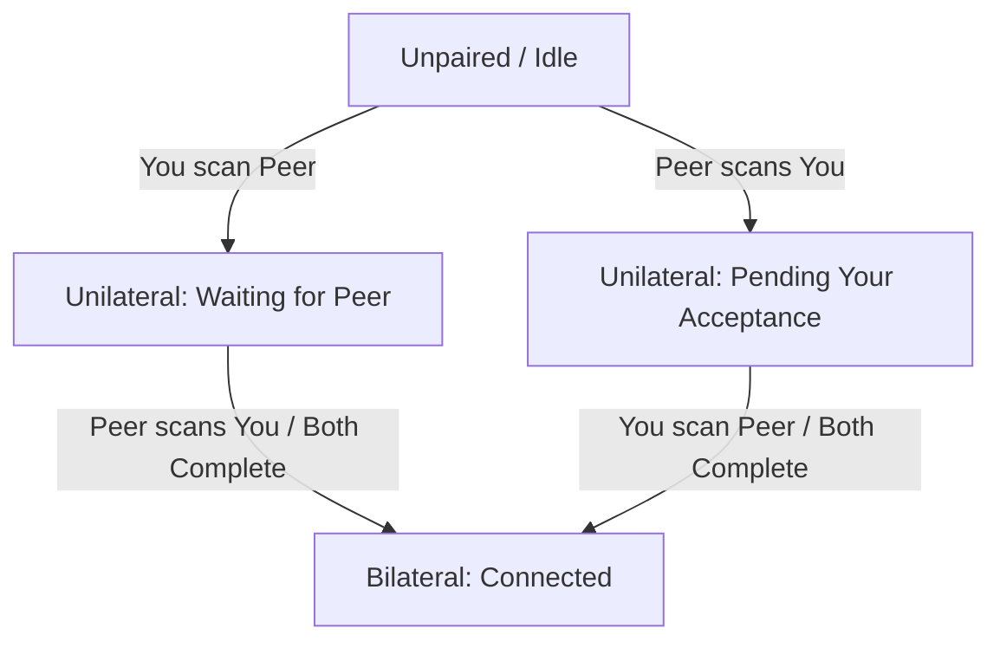

# EchoIt Product Definition

EchoIt is a local-first, privacy-respecting messaging application targeting mobile (Android, iOS) and desktop devices. This document establishes the brand positioning, verbal guidelines, tone of voice rules, and product postures for the app.

---

## 1. Audience & Positioning

EchoIt is built for **ordinary, everyday people** who want to communicate privately without their personal lives being scanned, harvested, or stored by tech conglomerates. It is designed as a direct, privacy-respecting WhatsApp alternative. 

### The Core Posture
Our verbal posture is anchored to a single, non-negotiable statement of fact:

> **"Your messages stay on your phone. We can't read them. We don't want to."**

We speak to the user's desire for personal space. We do not sell high-tech sovereignty; we offer peace of mind.

### The Claim, Stated Exactly

Because the posture above is absolute, every narrower claim has to survive
inspection. EchoIt reaches a server in two places — finding the person you are
talking to, and asking whether there is a new version — and we say both rather
than let someone discover them:

> **"Phones move around and have no fixed address, so EchoIt uses a helper to
> introduce your device to your friend's. After that, your messages go straight
> from your phone to theirs. If the two phones can't reach each other directly,
> the helper passes the messages along still sealed — it cannot open them. The
> only other server EchoIt talks to is the one it asks whether there's a new
> version."**

Still deliberately checkable — anyone can watch the network — and now what they
see matches what we said. A helper can tell that a device is online and roughly
where it is connecting from. It cannot read a word of what it carries, and it
never holds anything: a message for someone who is offline is dropped, not
stored. Whether a helper can work out *which two* devices are reaching for each
other has not been tested here, so we do not claim that it cannot. See §4.4 for
the helper and §4.3 for the update check.

The strict CSP still means the app's screens cannot fetch from anywhere on the
web. It was never the reason the earlier claim held: the helper is reached by
the app's networking layer rather than by the web layer, so the CSP never
covered it, which is how this went unnoticed for as long as it did.

**Do not write, anywhere, ever:** "EchoIt never connects to a server", "nothing
ever leaves your device", "no data is ever transmitted", or "the only time the
app talks to a server is to check for updates". Each is false by a small
margin, and a small false claim is what makes people doubt the large true
ones.

---

## 2. Brand Personality

Our personality is **warm, quiet, and unhurried**. 

EchoIt should feel closer to a **paper notebook** than a high-tech control panel. It is a quiet corner for conversation, not a dashboard or a command-line terminal.

| Trait | What it means | What it is NOT |
| :--- | :--- | :--- |
| **Warm** | Tactile, human, and comforting. We use soft, clear language and organic tones. | Soft-pedaling, clinical, or overly casual (no excessive emojis or hype). |
| **Quiet** | Calm and low-friction. We respect user attention. Notifications are minimal and text is direct. | Cluttered, noisy, or demanding. No gamification or engagement loops. |
| **Unhurried** | We let actions take their natural time. Building a secure local connection is treated with care. | Slow or unresponsive. We optimize performance but do not rush the user. |
| **Local** | Everything stays with the user. The device is the center of their messaging universe. | Cloud-dependent, centralized, or remote. |
| **Direct** | Clear, honest, and plain-spoken. We describe what is happening without sugarcoating. | Technical, jargon-dense, or cryptographic. |

---

## 3. Verbal Rules (Non-Negotiable)

To ensure the app remains accessible to ordinary people, **never lead with cryptographic or protocol jargon**. Focus on the utility and physical reality of the user's actions.

### Jargon Translation Guide

*   **Never lead with**: "decentralized", "zero-knowledge", "peer-to-peer", "protocol", or "cryptographic".
*   **Instead, describe the outcome**:

| Technical Concept (Do Not Use in UI) | Human Copy (Always Lead With) |
| :--- | :--- |
| *Zero-knowledge protocol* | "We design the app so we have no access to your conversations." |
| *Peer-to-peer connection* | "Messages go directly from your device to theirs." |
| *Cryptographic identifier (DID)* | "Your private identity ticket" or "your safe address." |
| *Decentralized architecture* | "There is no central server holding your history; it lives only on your phone." |
| *Pairing handshake / key exchange* | "Connecting your devices directly." |
| *Relay / STUN / NAT traversal / discovery* | "A helper that introduces your device to theirs." |

---

## 4. Crucial Disclosures & Limitations

EchoIt values radical transparency. We must tell the truth about what our technology can and cannot do. We never create a false sense of security.

### 1. Local Device Security (At-Rest Encryption) *(rewritten 2026-08-31 for SDK 0.8.1)*
*   **The Reality**: **Message text is now encrypted on the device.** *(Verified
    against SDK 0.8.1 by reading it: `message-store.js` seals `content` through
    `SecretBox`, and `document-store.js` seals the CRDT snapshot bytes. The key
    is derived from the recovery phrase and held in the OS keychain, and the SDK
    refuses to open an on-disk database without one.)*

    **What is still readable** matters and must not be glossed over. The
    surrounding columns are not sealed: `author_did`, `timestamp` and
    `channel_id` are stored as they are, because the database is queried by
    them. So someone with the phone's filesystem can establish **that** you had
    a conversation, **with whom**, and **when** — but not **what was said**.

    Before 0.8.1 none of it was encrypted. That was disclosed while it was true,
    and this section is the record of it changing rather than a quiet edit.
*   **Verbal Rule**: We may now say the words are encrypted. We must **not**
    stretch that into "your history is private on your device", because who and
    when are not covered. Never imply that encryption at rest protects a phone
    someone else is holding **unlocked** — the app opens the messages for
    whoever is using it. Keep guiding people to a lock screen.
*   **UI Warning Copy**:
    > *"Your chat history is kept on this phone and the messages themselves are
    > encrypted, so someone who copies the files off your device cannot read
    > them. They could still see who you have spoken to and when. And anyone
    > holding your unlocked phone can simply open the app — so a strong lock
    > screen password or PIN is still what protects you."*

### 3. Update Checks *(settled 2026-08-20; server claim corrected 2026-08-30)*

*   **The Reality**: EchoIt checks GitHub once a day to see whether a newer
    version exists. The request carries no identifier, no counter, and nothing
    about you — but GitHub can see an IP address and roughly when the app was
    opened. It is **not** the only server the app contacts; see §4.4.
*   **Verbal Rule**: We say this out loud rather than hoping nobody asks. We
    never write "EchoIt never connects to a server", and — since 2026-08-30 —
    we no longer write *"it's the only time the app talks to a server"* either.
    Both are false, and a small false claim undermines the large true ones.
*   **UI Copy** (Settings, beside the toggle):
    > *"Check for updates — EchoIt asks GitHub once a day whether a newer
    > version is available. It sends nothing about you or your conversations.
    > You can turn this off, but then you'll need to check for new versions
    > yourself."*
*   **Control**: A toggle in Settings, on by default.

### 4. The connection helper — the other server *(settled 2026-08-30)*

*   **The Reality**: Two phones on mobile networks cannot normally dial each
    other, so on every launch EchoIt does two things through infrastructure it
    does not own end to end. It **publishes** where this device can currently be
    reached, so the other person's phone can find it. And it keeps a **helper**
    on standby to introduce the two devices, which also carries the messages if
    no direct path can be made. Both are contacted whether or not you send
    anything. Measured on hardware, every conversation so far has gone
    **directly** between devices — the helper introduced them and then stepped
    out of the way — but that is the common case, not a guarantee.
*   **What it can and cannot see**: It can see that a device is online and
    roughly where it is connecting from. It cannot read anything it carries, and
    it stores nothing — a message for someone who is offline is dropped rather
    than held (§AGENT_INSTRUCTIONS §3). Whether it can determine which two
    devices are reaching for each other is **untested**, so we do not claim it
    cannot.
*   **Verbal Rule**: Never call this "peer-to-peer with no servers", and never
    describe anything we host as "zero knowledge" — true of content, false of
    metadata, and §4.2 forbids claiming protection we do not have. Say
    **helper**, not "relay", "STUN", "NAT traversal", or "discovery" (§3).
*   **UI Copy** (Settings):
    > *"Connecting — Phones move around and have no fixed address, so EchoIt
    > uses a helper to introduce your device to the person you're messaging.
    > Once they've been introduced, messages go straight between the two
    > phones. If they can't reach each other directly, the helper passes them
    > along sealed — it can't read them, and it never stores one."*
*   **Control**: **None today.** The helper cannot be turned off, because
    without it the app cannot find anyone. Say so if asked; do not imply a
    choice exists.

### 2. Spam Protection
*   **The Reality**: The anti-spam machinery (including rate-limiting RLN proofs for identified channels) is deactivated in the current build.
*   **Verbal Rule**: We **must not** claim or promise any form of spam protection, message rate-limiting, or automated system defense in user-facing copy.

---

## 5. Pairing States & Microcopy

Pairing in EchoIt is mutual and can fail silently: if only one person adds the other's ticket, the dialing device shows "connected" but messages will never be delivered to the other side. 

To solve this, we define three distinct visual and verbal states to make incomplete pairing highly visible.

### State 1: Unilateral — Waiting for Them (You added them, they haven't added you)
*   **Visual Indicator**: Muted clay/rust circle icon, dashed border. Outbox messages show as **`Staged`**, never `Sent` (see §5b).
*   **Primary Copy**:
    > *"Waiting for [Name] to connect back."*
*   **Explanatory Microcopy**:
    > *"You've added [Name], but they haven't added you yet. To start messaging, [Name] needs to scan your ticket or copy your connection link."*

### State 2: Unilateral — Pending Your Acceptance (They added you, you haven't added them)
*   **Visual Indicator**: Clay dot (`--color-primary`) on the Contacts tab and
    an inline banner at the top of the conversation. **No notification, no
    push, no badge on the app icon** — a knock never interrupts you (see the
    request rules below). The written spec once called for a "soft blue dot";
    the palette has no blue and deliberately runs warm, so clay is used
    instead. If invitations ever need to read as distinct from state 1 at a
    glance, that is a decision to add one cool accent to the system, not to
    improvise a colour here.
*   **Identity Resolution**:
    *   *With Display Name Metadata*: If the ticket was received containing an out-of-band self-asserted name (e.g., bundled in a QR or invite link):
        *   **Primary Copy**: *"[Name] wants to connect with you."*
        *   **Action button**: *"Connect with [Name]"*
    *   *Without Name (Genuine Stranger / Raw Ticket)*: If no display name metadata is available:
        *   **Primary Copy**: *"A new peer wants to connect"* or *"A device (ending in ...[last 4 of ID]) wants to connect."*
        *   **Action button**: *"Connect"*
*   **Explanatory Microcopy**:
    > *"Once you accept their ticket, you will be able to exchange messages directly. No messages can be delivered until you connect back."*
*   **Connection requests**: A stranger who connects lands in a **Requests**
    list. Nothing is ever pushed — no notification, no banner, no badge. You look
    when you feel like looking, which in practice is right after you have given
    someone your ticket.

#### Requests — the whole rule *(simplified 2026-08-19)*

Three sentences, deliberately:

1.  **A stranger cannot send you anything but a knock.** Until you add them back
    the protocol drops their messages, so no text, image or link reaches you
    without your consent. This is what lets everything else stay simple.
2.  **Knocks wait in a list and never interrupt you.**
3.  **You Accept, Ignore, or Block — and the other person is never told which.**

**The silence is the safety feature and must not be softened.** Telling someone
they were ignored confirms the address is real and that a person saw them, which
is exactly what someone persistent is trying to learn. We also could not enforce
a "try again later" rule if we announced one — there is no server to enforce it —
and §4.2 forbids claiming protection we do not have.

*Ignore* removes the knock; if they knock again it reappears. *Block* means it
never appears again. Both are local to your device.

A knock carries no name. Anything shown beside it travelled **out of band** in
the invite link, and is the sender's own unverified claim.

### State 3: Bilateral — Fully Paired (Both sides have added each other)
*   **Visual Indicator**: Soft, solid slate-green circle indicator.
*   **Primary Copy**:
    > *"Connected directly"*
*   **Explanatory Microcopy**:
    > *"Messages are moving safely, directly between your phones."*

---

## 5b. Delivery & Read Status *(design settled 2026-08-19; build later)*

Carried over from an earlier EchoIt iteration and kept because it suits this
product better than the alternative. **Not built yet** — it has a hard
dependency, recorded below.

WhatsApp's double blue tick is loud, binary, and slightly accusatory. We use the
quieter pattern: the recipient's own picture, appearing and then gaining colour.
It says the same thing without raising its voice, and it extends to groups
unchanged if we ever need it to.

### The ladder

| State | What is true | Signal |
| :--- | :--- | :--- |
| **Staged** | Pairing is incomplete. Nothing has been attempted. | No badge. The **composer is disabled** and the bubble is dashed — this is a pairing problem, not a delivery problem, and must not be dressed as one |
| **Sent** | The message left this device | Small grey tick inside a grey ring |
| **Delivered** | It reached their device | Their picture, **desaturated**, beneath the message |
| **Read** | They opened it | Their picture, **full colour** |

Only the last message in a run carries a picture, as Messenger does. A column of
avatars down the thread is noise.

### Three problems to solve before building this

1. **We have no profile pictures.** Identity is a `did:key`; there is no avatar,
   no stored display name, no profile of any kind. The whole pattern rests on
   there being a picture to desaturate. **This needs a profile layer first**, and
   a decision on the fallback — a desaturated monogram disc is a far weaker
   signal than a desaturated photo, and may need a second cue.
2. **Read receipts are optional (M4.3.1), and "off" must not look like "unread".**
   If the recipient disables them their picture never gains colour, which is
   indistinguishable from not having read it. When we know receipts are off,
   the sender's UI must **stop at delivered** and stop implying a pending read.
3. **Read has no protocol support.** Delivery can be inferred from the transport;
   "read" cannot. It needs an application-level receipt message, which is ours to
   define — our client sits on both ends — but it is real work, not a display
   change.

### Verbal rules

Never "seen". Never a timestamp of when someone read something unless they asked
for it. The picture appearing is the whole message; do not caption it.

---

## 6. Needs from the App Team

These are design requirements identified during the definition phase that must be addressed in the core application logic.

1.  **Local Encryption at Rest (M2.2.2 / Keychain Integration)**: To support future claims of absolute local safety, the SDK storage must eventually encrypt message bodies and CRDT databases at rest using keys derived from the OS Keychain (DPAPI, Android Keystore, iOS Keychain).
2.  **Active Outbox Statuses**: The application message model must track message state as `Staged` (waiting for mutual pairing) separately from `Sent` (delivered to the local transport queue) to avoid misleading the user while pairing is incomplete.
3.  **Silent Screening Queue**: The application state machine must maintain a record of our generated active/recent tickets and route uncorrelated inbound peer handshakes to a quiet screening folder instead of surfacing them.

---

## 7. Upstream Requests for DicsussionProtocol (SDK 0.2.0)

We require the following platform-level capabilities from the underlying SDK before the visual and verbal system can be fully realized:

1.  **Inbound Connection Eventing**: The SDK public API must expose an event (e.g. `onInboundConnection(peerDid)`) or connection stream. Because the handshake succeeds at the session-manager layer and authenticates the `peerDid` before checking if the peer is paired, the SDK must provide a hook to notify the application of these attempts. The app can then trigger State 2 ("Pending Your Acceptance") when an unpaired peer handshakes successfully.
2.  **Bridged-Transport Factory**: Export a unified `createBridgedTransport(pipe)` interface in `@dicsussion/core/transport` to keep the security-critical handshake sequencing inside the SDK while allowing non-Node hosts (Tauri, React Native) to provide the raw byte channel.
