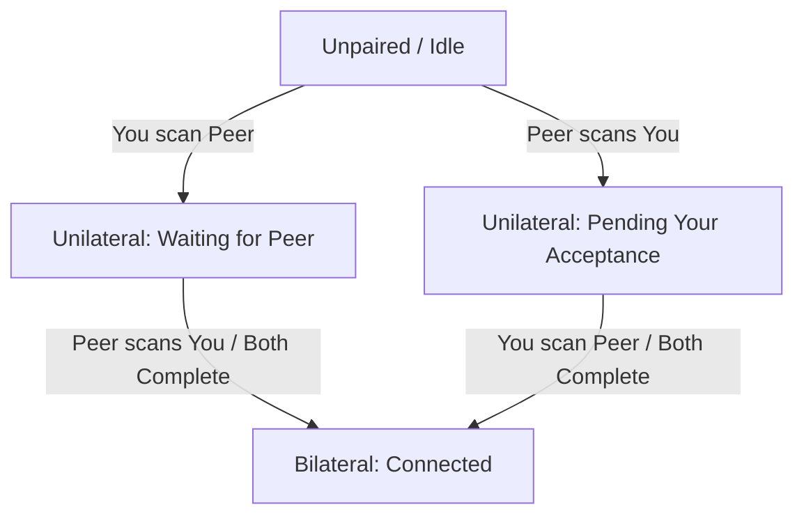

# EchoIt Product Definition

EchoIt is a local-first, privacy-respecting messaging application targeting mobile (Android, iOS) and desktop devices. This document establishes the brand positioning, verbal guidelines, tone of voice rules, and product postures for the app.

---

## 1. Audience & Positioning

EchoIt is built for **ordinary, everyday people** who want to communicate privately without their personal lives being scanned, harvested, or stored by tech conglomerates. It is designed as a direct, privacy-respecting WhatsApp alternative. 

### The Core Posture
Our verbal posture is anchored to a single, non-negotiable statement of fact:

> **"Your messages stay on your phone. We can't read them. We don't want to."**

We speak to the user's desire for personal space. We do not sell high-tech sovereignty; we offer peace of mind.

---

## 2. Brand Personality

Our personality is **warm, quiet, and unhurried**. 

EchoIt should feel closer to a **paper notebook** than a high-tech control panel. It is a quiet corner for conversation, not a dashboard or a command-line terminal.

| Trait | What it means | What it is NOT |
| :--- | :--- | :--- |
| **Warm** | Tactile, human, and comforting. We use soft, clear language and organic tones. | Soft-pedaling, clinical, or overly casual (no excessive emojis or hype). |
| **Quiet** | Calm and low-friction. We respect user attention. Notifications are minimal and text is direct. | Cluttered, noisy, or demanding. No gamification or engagement loops. |
| **Unhurried** | We let actions take their natural time. Building a secure local connection is treated with care. | Slow or unresponsive. We optimize performance but do not rush the user. |
| **Local** | Everything stays with the user. The device is the center of their messaging universe. | Cloud-dependent, centralized, or remote. |
| **Direct** | Clear, honest, and plain-spoken. We describe what is happening without sugarcoating. | Technical, jargon-dense, or cryptographic. |

---

## 3. Verbal Rules (Non-Negotiable)

To ensure the app remains accessible to ordinary people, **never lead with cryptographic or protocol jargon**. Focus on the utility and physical reality of the user's actions.

### Jargon Translation Guide

*   **Never lead with**: "decentralized", "zero-knowledge", "peer-to-peer", "protocol", or "cryptographic".
*   **Instead, describe the outcome**:

| Technical Concept (Do Not Use in UI) | Human Copy (Always Lead With) |
| :--- | :--- |
| *Zero-knowledge protocol* | "We design the app so we have no access to your conversations." |
| *Peer-to-peer connection* | "Messages go directly from your device to theirs." |
| *Cryptographic identifier (DID)* | "Your private identity ticket" or "your safe address." |
| *Decentralized architecture* | "There is no central server holding your history; it lives only on your phone." |
| *Pairing handshake / key exchange* | "Connecting your devices directly." |

---

## 4. Crucial Disclosures & Limitations

EchoIt values radical transparency. We must tell the truth about what our technology can and cannot do. We never create a false sense of security.

### 1. Local Device Security (At-Rest Encryption)
*   **The Reality**: The application security key protects your cryptographic identity secrets. However, **message bodies and history are not currently encrypted at rest on the device**. Anyone with access to the physical filesystem of the phone can read the database in plaintext.
*   **Verbal Rule**: We say *"Your messages stay on your phone."* We **never** write copy implying that *"Your messages are protected on your phone"* or *"Your local history is encrypted."* We must explicitly guide the user to secure their physical device.
*   **UI Warning Copy**:
    > *"Your chat history is stored locally on this phone. Because message files are not encrypted on your device's disk, someone who gains physical access to your phone might be able to read them. We recommend keeping a strong lock screen password or PIN enabled."*

### 2. Spam Protection
*   **The Reality**: The anti-spam machinery (including rate-limiting RLN proofs for identified channels) is deactivated in the current build.
*   **Verbal Rule**: We **must not** claim or promise any form of spam protection, message rate-limiting, or automated system defense in user-facing copy.

---

## 5. Pairing States & Microcopy

Pairing in EchoIt is mutual and can fail silently: if only one person adds the other's ticket, the dialing device shows "connected" but messages will never be delivered to the other side. 

To solve this, we define three distinct visual and verbal states to make incomplete pairing highly visible.

### State 1: Unilateral — Waiting for Them (You added them, they haven't added you)
*   **Visual Indicator**: Muted clay/rust circle icon, dashed border. Outbox messages show as "Paused" or "Staged" rather than "Sent".
*   **Primary Copy**:
    > *"Waiting for [Name] to connect back."*
*   **Explanatory Microcopy**:
    > *"You've added [Name], but they haven't added you yet. To start messaging, [Name] needs to scan your ticket or copy your connection link."*

### State 2: Unilateral — Pending Your Acceptance (They added you, you haven't added them)
*   **Visual Indicator**: Soft blue dot, notification banner at the top of the chat.
*   **Identity Resolution**:
    *   *With Display Name Metadata*: If the ticket was received containing an out-of-band self-asserted name (e.g., bundled in a QR or invite link):
        *   **Primary Copy**: *"[Name] wants to connect with you."*
        *   **Action button**: *"Connect with [Name]"*
    *   *Without Name (Genuine Stranger / Raw Ticket)*: If no display name metadata is available:
        *   **Primary Copy**: *"A new peer wants to connect"* or *"A device (ending in ...[last 4 of ID]) wants to connect."*
        *   **Action button**: *"Connect"*
*   **Explanatory Microcopy**:
    > *"Once you accept their ticket, you will be able to exchange messages directly. No messages can be delivered until you connect back."*
*   **Spam & Unsolicited Connection Throttling**:
    Because the anti-spam proofs are deactivated, the UI implements a silent screening queue to prevent prompt harassment:
    *   *Correlated Connections*: If the inbound connection matches a ticket we generated and marked active/recent (within 48 hours), pop up a notification.
    *   *Uncorrelated Connections (Silent Queue)*: If a stranger connects without a matching active ticket, the handshake succeeds silently in the background (as per protocol design), but the UI **does not** push a notification or show a chat list banner. Instead, the request is quietly routed to a "Pending Invitations" screen under Settings where the user can review requests in their own time.
    *   *Rate Limiting*: Surfaced prompts for uncorrelated invitations are throttled to a maximum of 3 notifications per hour.

### State 3: Bilateral — Fully Paired (Both sides have added each other)
*   **Visual Indicator**: Soft, solid slate-green circle indicator.
*   **Primary Copy**:
    > *"Connected directly"*
*   **Explanatory Microcopy**:
    > *"Messages are moving safely, directly between your phones."*

---

## 6. Needs from the App Team

These are design requirements identified during the definition phase that must be addressed in the core application logic.

1.  **Local Encryption at Rest (M2.2.2 / Keychain Integration)**: To support future claims of absolute local safety, the SDK storage must eventually encrypt message bodies and CRDT databases at rest using keys derived from the OS Keychain (DPAPI, Android Keystore, iOS Keychain).
2.  **Active Outbox Statuses**: The application message model must track message state as `Staged` (waiting for mutual pairing) separately from `Sent` (delivered to the local transport queue) to avoid misleading the user while pairing is incomplete.
3.  **Silent Screening Queue**: The application state machine must maintain a record of our generated active/recent tickets and route uncorrelated inbound peer handshakes to a quiet screening folder instead of surfacing them.

---

## 7. Upstream Requests for DicsussionProtocol (SDK 0.2.0)

We require the following platform-level capabilities from the underlying SDK before the visual and verbal system can be fully realized:

1.  **Inbound Connection Eventing**: The SDK public API must expose an event (e.g. `onInboundConnection(peerDid)`) or connection stream. Because the handshake succeeds at the session-manager layer and authenticates the `peerDid` before checking if the peer is paired, the SDK must provide a hook to notify the application of these attempts. The app can then trigger State 2 ("Pending Your Acceptance") when an unpaired peer handshakes successfully.
2.  **Bridged-Transport Factory**: Export a unified `createBridgedTransport(pipe)` interface in `@dicsussion/core/transport` to keep the security-critical handshake sequencing inside the SDK while allowing non-Node hosts (Tauri, React Native) to provide the raw byte channel.
